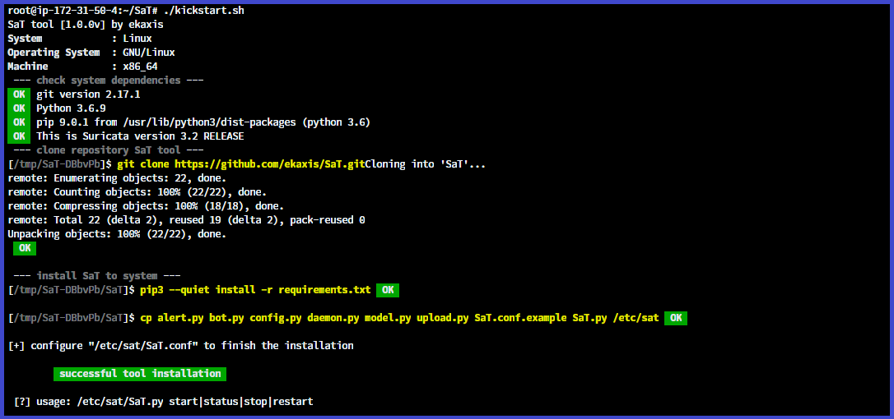

# SaT

**SaT** (Security Alert Tool) é uma ferramenta escrita em [Python](https://www.python.org/) para ajudar a manter a segurança de servidores, deixando você por dentro de ataque e scanners de hackers na rede com a ajuda da ferramenta [SURICATA](https://suricata-ids.org/) ou [SNORT](https://www.snort.org/) (funciona com ambos softwares), gerando notificações por meio de um bot no Telegram e armazenando logs mapeados para um banco de dados relacional, facilitando também possíveis analise de dados.

Está versão da ferramenta funciona como agente, ela monitora os alertas gerados pelo Snort ou Suricata e em determinada condição avisa o administrador por meio do bot no Telegram. Além de salvar todos logs mapeados em um modelo relacional no banco de dados SQLite e enviar os alertas em determinados períodos de tempo definidos por você para a extensão servidor do **SaT**.

### Detalhes técnicos

**SaT** fica em execução esperando novas entradas no arquivo de log do NIDS, assim que é gerada uma nova linha de log ele armazena no banco de dados caso não exista e verifica se a prioridade é a mínima definida para notificar o administrador no Telegram, caso seja, a mensagem é enviada no formato pré definido e com as informações mais relevantes.

### Requisitos

Para instalar a ferramenta você precisa logicamente do SNORT ou SURICATA instalado no seu servidor e Python3 3.5.* ou superior e o gerenciador de pacotes python **pip**.

### Instalação

dependências do python

* python-dotenv>=0.13.0
* peewee>=3.13.3
* telepot>=12.7
* requests>=2.23.0

Ter o token do bot do Telegram, e o chat_id para que será enviado as mensagens, caso não tenha basta cria-lo. 
E por fim configurar copiar o arquivo SaT.conf.example para SaT.conf e preencher com as informações necessárias.

Para executar a ferramenta basta digitar o comando ``/path/SaT.py start`` 

> OBS: Se você utiliza o snort deve está rodando como daemon com o parametro ``-A fast`` pois o mapeamento para objeto e banco de dados depênde desse formato de log. 

